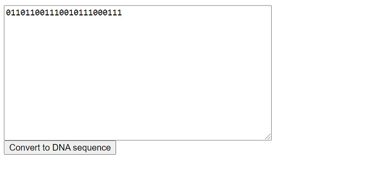

# DNAtoBinaryJs
Quickly convert a DNA sequence into binary code and vice versa. Javascript. Includes a simple demo.



# Usage
Include the javascript file in the header.
```html
<script src="d2b.js"></script>
```

to convert from DNA to binary
```js
var str = 'CGTATGCCTACT';
var r = dna2binary( str );
```

to convert from binary to DNA
```js
var str = '011011001110010111000111';
var r = binary2dna( str );
```

# Demo
Simply run index.html in a browser for a simple working version.
